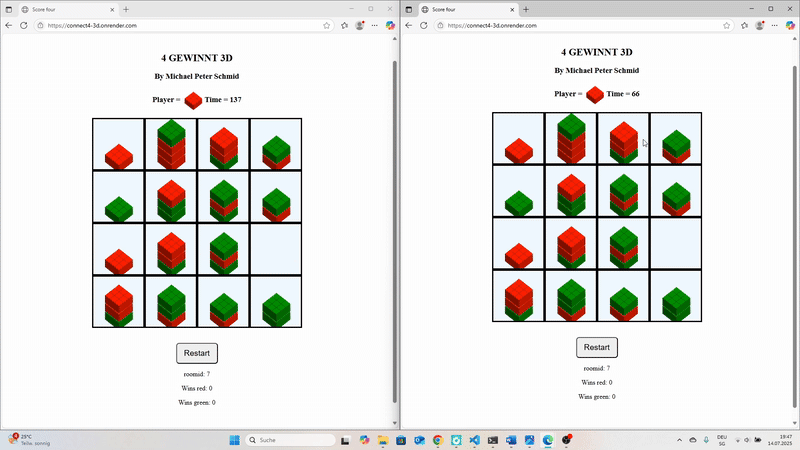
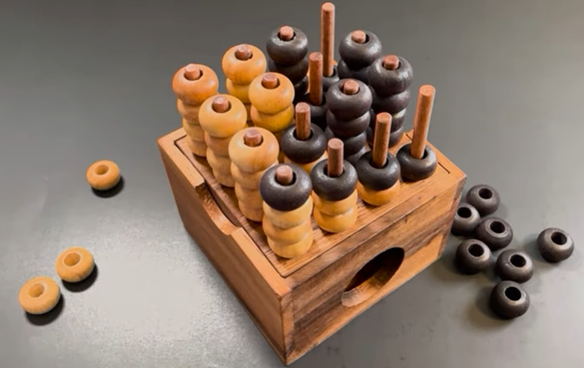

### Online Connect 4 3D Game
- you can play this classic board game online with your friends (2 different devices needed): https://connect4-3d.onrender.com/
- or if you want to play against your friend on the same device you may use this site: https://michaelpeterschmid.github.io/connect-4-3D-static/
- Soon the local offline version will be available in the google play store!

- what is connect 4 3D?
  - Connect Four in 3D, also known as 3D 4 in a Row, is a variation of the classic Connect Four game played on a three-dimensional grid. The objective is to be the first player to connect four of their game pieces in a row, either horizontally, vertically, or diagonally, in any of the three dimensions. good explanation: https://www.youtube.com/watch?v=c81LFAc1Uq8

**This is what the my online version looks like**

**This is what the game looks like originially**

